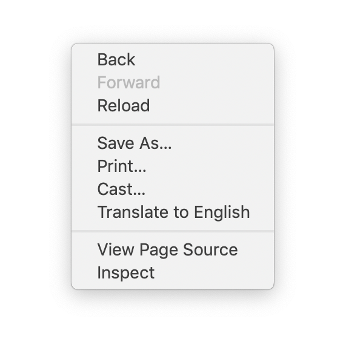
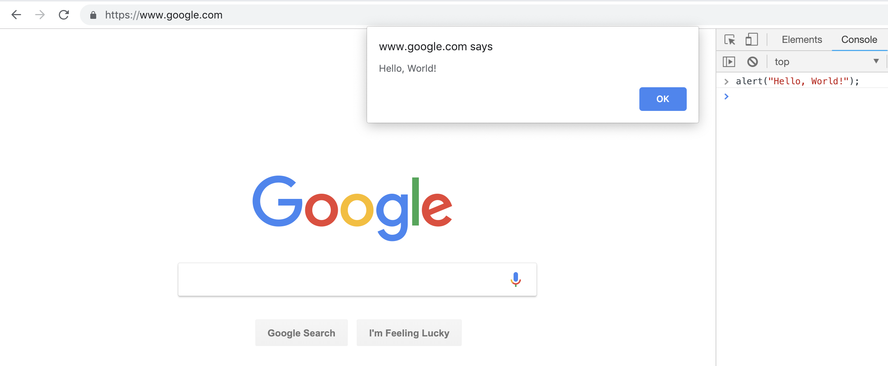

## Overview

For this tutorial, we will walk you through on the fundamentals of JavaScript as a language. We'll focus on building on your knowledge of the core concepts of JavaScript.

## Hello, World!

We begin learning JavaScript with the best-selling introduction to programming: **"Hello, World!"**. This is usually the first ever exercise when learning a new programming language. This exercise simply lets you output the words "Hello, World!" in the language you're learning.

Mentioned earlier in [HTML, CSS, JavaScript: How They Work Together](contents/web/html_css_js.md) is how JavaScript mostly deals with bringing interaction to our websites. As such, it seems fit that we use a web browser to run our first line of JS code.

### Console

Begin by opening your preferred web browser. In the screenshot guides, we used Google Chrome.

Right click on anywhere in your web browser and select the option to "Inspect" or "Inspect Element".



This will open the Inspector where you can see details about the web page you're currently viewing. Open the tab "Console".


Then, write your JS code by entering the following line to the console:

```
console.log("Hello, World!");
```

which should output something similar to what's shown below:


Now, let's look into what just happened. You just instructed your browser to print "Hello, World!" by placing this text inside the parenthesis for the function `console.log`. As its name suggests, it logs to the console whatever you want it to.

### Alert

Printing to the console is cool but normal visitors of a website won't really go to the trouble of checking "Inspect Element" to see what you logged in the console. However, you may have encountered an alert before.

An alert is the pop up window that shows up on the top of your browser. The common reasons why this appears is to either

1. warn you that what you're doing is not allowed or
2. confirm if you're sure you want to proceed with a certain action.

To try this out, enter the following in the console:

```
alert("Hello, World!);
```



## Exercises

1. Try to see what happens when you change the text "Hello, World!".

```
console.log("I can print anything here!");

alert("This is a function call.");
```

2. What happens if you remove the quotation marks?

3. Try printing numbers too! Did it work?

## Wrap Up

You just learned two different ways of printing "Hello, World!". `console.log` will come in handy later when debugging while `alert` can be used to show warnings to users of your site.

More importantly though, you made a function call which we'll be learning more about later on. For now, it's a good observation to note that whatever we passed inside the parenthesis will be used by the function.
