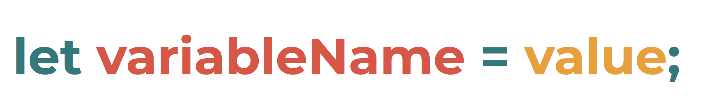
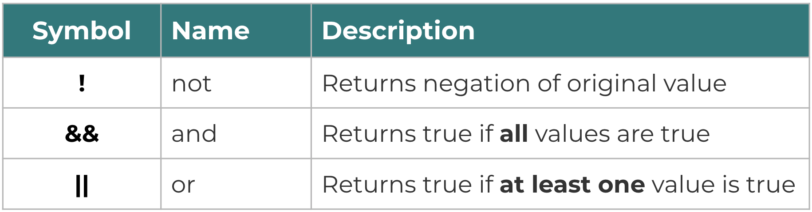

## Overview

In this section, we will be learning about variables and the basic data types in JavaScript.

## Data Types

All values declared in JavaScript can be classified under a certain data type.

Data types show us what kind of values we can use in our code as well as what kind of operations we can do on those values. They tell us the classifications and behavior of the different kinds of values that we can represent in our program.

In JavaScript, almost all of the data types are **immutable**. This means they **cannot be modified or changed**. These kinds of data types are called **primitive values** or simply **primitives**. The exception to this are **objects (and functions)**, which can be modified.

> As of writing this document, there are **9 data types** in defined in the ECMAScript standard.

## Variables

Before we learn about the different data types, let's take a look first into the concept of variables.

A variable, like in Math, is used to represent something in our code. What is "something"? It could be any of the data types (which we'll learn more about later on).

One common way to think about variables would be perhaps a box that you own and put values in. The usual way of declaring variables is using `let` followed by the name you want to call your variable. If you would like to assign a value to a variable, you use the `=` equals sign followed by the value you want to save to the variable you just declared.



Notice as well that there's a semicolon at the end of our variable declaration. We usually place semicolons (;) at the end of every line in JavaScript (except for code blocks).

### Variable Names

In general, there are two rules when it comes to naming your variables.

1. You can only use a combination of letters (`a-z`, `A-Z`), numbers (`0-9`), and the symbols `$` and `_` for your variable name.
2. You cannot have a number as the first character of your variable name.

Also, multi-word variable names are usually written in `camelCase` where the next words begin with a capital letter, but you may come across some code that uses the `snake_case` where words are separated by the underscore symbol.

> When declaring variable names, we usually try to be as descriptive as possible to make our code readable.

#### Exercises

Test out different variable names to check whether they are valid variable names or not.

1. Try doing `let 1apple;` on the console and see what happens. Did it show an error?
2. Try out declaring a variable using your name `let <your first name here>;`. For example, in my case, I did `let reg;`. Did it show an error?
3. Declare a variable using your first name and last name separated by a hyphen (`-`).
4. Declare a variable using your first name and last name separated by an underscore (`_`).

## Primitive Values

Now that you know more about declaring variables, let's go back to the data types to know what values we can place on the right side of the equals (`=`) operator.

There are **6 primitive values** in JavaScript, with one additional **special case**. In a way, you can say there is a total of 7 primitive values.

As mentioned earlier, all primitives are **immutable**, meaning their values cannot be changed in the same way that objects and functions can. This may sound a bit confusing for now, so we'll revisit this as we get into the specific date types. For now though, let's just keep in mind that primitives **cannot be directly altered**, but they can be **replaced**.

### Undefined

Let's start with Undefined, the first primitive value we'll learn in JavaScript. This data type represents an **unintentional missing value**. There exists **only one** value in JavaScript with this data type, and it's also called `undefined`. 

It usually shows up if you forgot to assign a value to a variable and in other situations where the code doesn't know what value that you wanted. If this happens, we say that our variable contains the value `undefined`.

> So far, we've been imagining variables as *boxes* that *contain* values. Boxes are a common mental model of developers for variables. It's what we default to when we think of variables and when we try to describe variables to other people. However, I want to share a different perspective which I found from Dan Abramov's newsletter called [JustJavaScript](JustJavaScript.com) which I recommend that you check out once you're already familiar with the basics of JavaScript. In his mental model, he thinks of variables as *"wires"* that *point to* values. That's all that I'll say about it for now!

#### Exercises

1. Declare a variable called `x`.
2. Log the value of `x` to the console.

```
let x;
console.log(x);
```

In the exercise you did, we declared a variable called `x` and did not assign any value to it. Hence, it outputs **undefined**. So far, we've been unintentionally assigning the value `undefined` when we learned about variables in the previous section.

Don't be confused with its name `undefined`. It's **not** supposed to represent something that hasn't been defined yet. In fact, if you try to run `console.log` on a variable that hasn't been declared, it will show an error. Try out the example below where we did not declare the variable `y` in our code.


#### Exercise

1. Log the value of an undeclared variable `y` to the console. What was the result of logging to the console?

```
console.log(y);
```

If you got an error while trying to do the exercise above with the message `Uncaught ReferenceError: y is not defined`, then this is telling us that **undefined is not the same as not defined!**

Finally, as we explore the different data types, we'll be making use of a new function called `typeof`.

> `typeof` is a function in JavaScript that returns the data type of whatever is passed in between its parenthesis. Note that the value returned by `typeof` is a string. Don't worry if you're not yet sure what a string is, we'll be taking this on in a a bit.

#### Exercises

1. Declare a variable called `z`.
2. Log the value of `z` to the console.
3. Log the type of `z` to the console. (Hint: use the `typeof` operator to retrieve the data type of variable `z`)

For this exercise, note that the **value** of `z` is `undefined`, but the **type** of `z` is a string containing the word "undefined".

### Null

Null is the **special case** for primitives that we talked about earlier. Like `undefined`, there is also only **one value** in JavaScript with this data type. Same as the case for undefined, the only value for the null data type is also called `null`!

If undefined was used for unintentional missing values, null on the other hand is used for **intentional missing values**. Developers usually assign their variables the value `null` in cases where they might want to declare the variable, but assign its actual value later on.

An example is shown below where some dev might have declared a variable `x`, and intends to assign it the value 15 after some block of code is executed.

```
let x = null;
...
<other code>
...
x = 15;
console.log(x);
```

Arguably, the first line from our example could have also been just `let x;`. If we did this, `x` would have had the value `undefined` at first, but also lead to the same result of logging the value `15` at the end.

```
let x;
...
<other code>
...
x = 15;
console.log(x);
```

However, it's a convention for some developers to set it the value to `null` instead just to help us differentiate a mistake in our code from an intentional missing value. It might be a good idea to follow this practice, or to just avoid using both and declare a variable only when you plan on assigning it an actual value.

```
...
<other code>
...
let x = 15;
console.log(x);
```

We mentioned that `null` is a special case. What makes null so special? Try out the exercises below to see it yourself!

### Exercises

1. Declare a new variable called `age` and set its value to `null`.
2. Log to the console the value of `age`.
3. Log to the console the type of `age`. Was that the output you expected?

What did the exercise above tell us about the `type` of `null`? Recall that `typeof` is used to tell us what the data type is of the value passed to it.

```
console.log(typeof(null));
```

In case you're confused about this, `null` is still considered a `primitive value`. It's just pretending to be an `object`. This is actually the result of an irreversible bug from the past!

If you're interested to read more about this bug and why it can't be fixed, check out [The history of "typeof null"](https://2ality.com/2013/10/typeof-null.html).


### Booleans

The next primitive we'll take on are booleans. Booleans represent a logical entity in our code. They take on **two values** unlike Undefined and Null which both have one value each.

The two boolean values are `true` and `false`.

```
console.log(typeof(false));

let isLearning = true;
console.log(typeof(isLearning));
```

We usually use **logical operators** on boolean values. What are logical operators? If you've taken a philosophy class before, you might be familiar with the terms "not", "and", and "or". Feel free to skip this if you already know what logical operators are.

If you'd like to skip ahead to the next primitive value and learn about logical operators later on, that's also okay (you can always come back later)! [Click here to jump on ahead to Numbers.](contents/data_types_operators.md?id=numbers)

#### Logical Operators

We'll discuss the three logical operators in JavaScript, which are detailed in the table below. These are the not (`!`), and (`&&`), and or (`||`) operators.



To better understand how these operators work, let's dive in to some exercises instead.

#### Exercises

1. Declare a variable called `isRed` and set its value to `true`.
2. Log to the console the result of `!isRed`. `!` is the not operator.
3. Log to the console the result of `!!isRed`. Negating a negation just brings back the original value!
4. Declare a variable called `isRound` and set its value to `false`.
5. Log to the console the result of `isRed && isRound`. Here we're trying to check if something is both red AND round.
6. Log to the console the result of `isRed || isRound`. In this example, we're trying to see if something is either color red or is round in shape (or both!).
7. Change the value of `isRound` to `true` and try doing exercises 5 & 6 again. What changed in the output? Does it make sense with the description of the logical operators?
8. Try logging to the console the result of `true && true && true`. This shows us we can keep extending the `expression`. You can even try out `false || false || false || false` and keep going on and on...
9. Finally, try combining all three and use parentheses `()` to group statements together if it gets too complicated. `!true && (false || true) && !false`


