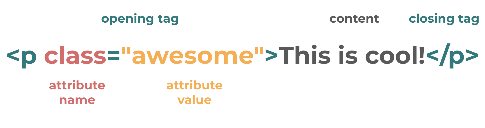
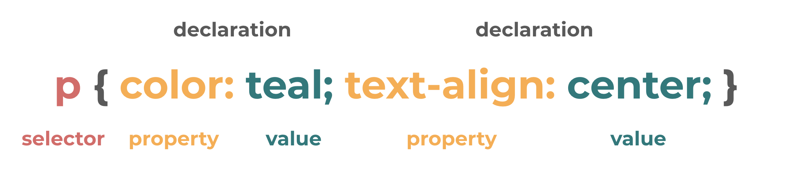
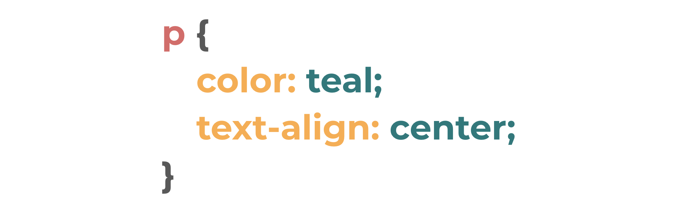

## Overview

Now that you know what HTML, CSS, and JavaScript are used for in a website. Let's do a quick recap of how to code in these languages before jumping into JavaScript.

By the way, Women Who Code also has [HTML & CSS Study Groups](https://wwcodemanila.github.io/WWCodeManila-HTML.CSS/#/)!

## HTML

The main purpose of HTML or Hypertext Markup Language is to give structure to your content as mentioned in [HTML, CSS, JavaScript: How They Work Together](contents/html_css_js.md). HTML is *markup language* (not a programming language) meaning it gives information about the structure of the text or instructions for how it is to be displayed.

When writing in HTML, you **define elements** in the form of **tags**. Some examples of these tags are `<head>, <body>, <title>, <link>, <meta>, <nav>, <section>, 
, 
, , <h1>, <a>, <form>, <table>, <script>, <ul>, <li>`. These tags are case-insensitive which means the tag `
` is the same with the tags `
`, `
`, and its other variations. However, it is common to use the lowercase version.

Also, these tags usually come in pairs. There's the **opening tag** (`
`) and the **closing tag** (`
`). There are cases, however, when an element is **self-closing** like ` ` or ``.

HTML elements can have **attributes** declared on the opening tag. Attributes help us know more about the properties of an element and are composed of a name and a value.

The typical HTML syntax is shown below: 

In this example, we are defining that the content "This is cool!" is a **paragraph** by enclosing it in the **p** tag. The entire `
This is cool!
` is an **element** composed of **p opening and closing tags** with the text "This is cool!". 

`class="awesome"` is an **attribute** of the paragraph element that tells us that the paragraph element has an attribute name of `class` with a value of `awesome`.

If we want to define another class (say `main-paragraph`) for the element, we include it inside the quotation marks and just separate the values using a space as in `
This is cool!
`. To add another class, we continue to add it like `
This is cool!
`.

If we want to add a different attribute, we just include a space after the first attribute and declare our next attribute like this: `
This is cool!
`. Here, we declared two attributes `class` and `id` where `class` has a value of `awesome` and `id` has a value of `cool-paragraph`.

It's important to know that the attribute **id** should be unique in a web page. If you've used the id `cool-paragraph` for one element, you can't declare another element with the same id. The attribute **class** on the other hand is reusable and doesn't have to be unique. You can declare several elements with the same class. This is particularly useful if you want several elements to have the same styles applied to them so they're easy to select later on using CSS.

Other HTML elements follow the same basic syntax. For a comprehensive list of HTML elements to use, you can check out [htmlreference.io](https://htmlreference.io/) and [W3Schools HTML Element Reference](https://www.w3schools.com/tags/). For a list of HTML attributes, you can check out [MDN HTML Attribute Reference](https://developer.mozilla.org/en-US/docs/Web/HTML/Attributes) and [W3Schools HTML Attribute Reference](https://www.w3schools.com/tags/ref_attributes.asp).

## CSS

On top of HTML we can add CSS or Cascading Style Sheets. CSS is a *style language* (also not a programming language) that, as its name suggests, lets us add styles and design to our site.

When writing code using CSS, we make use of **selectors** and **declarations**. Shown below is a basic CSS example using the selectors and declarations:

**Selectors** "select" the HTML element (or elements) that we want to apply the styles to while declarations tell us the actual styles to apply to the element selected. 

There are the element selectors where it's as simple as using name of the elements themselves like `p`, `h1`, `img`, `body`, `a`.

Elements can also be selected using the **class** selector. For example, to select the element`
This is cool!
` using the class class selector, we use the dot `.` character followed by the class name (`.awesome` and `.main-paragraph` will both give us the same result). So, if there were multiple elements in your HTML that have the class `awesome`, all of them will be selected.

If we want to be more specific in selecting elements, we can use the **id** selector. As mentioned earlier, the id is unique per page so by using the id selector we are targetting a very specific and unique element in the entire web page. To use this, we write the pound or hash `#` character followed by the id of the desired element. To select the element `
This is cool!
`, we use the selector `#cool-paragraph`.

Using commas, you can combine multiple selectors if you want to have the same styles applied to them. This helps prevent repeating code in the long run. If we want to select all `p` elements, `h1` elements, and `h2` elements to give them all a color of teal, we use the CSS `p, h1, h2 { color: teal; }`.

**Declarations** let us define what the styles would actually be for the elements that we just selected. A declaration block consists of several declarations that will be applied to the selector's selected elements. These blocks are enclosed in curly braces `{}`. Each declaration inside the declaration block consists of a **property** and a **value**. These declarations always end with a semi-colon `;` to separate them from other declarations.

In our example above, we are selecting all the paragraph elements in a web page using the *element selector* `p`. Then, we declare that its `color` property will have a value of `teal` and that its `text-align` property will have a value of `center`. This will make the color of the content in the paragraph elements teal and change the alignment of the paragraphs to be center-aligned.

When writing code in CSS, it's usually helpful to use line-breaks and indentations for each declaration. This would greatly improve code readability even though it won't change what is rendered on the page. To improve on our example earlier, we can format it to be written as:

For a list of the CSS properties you can use in your declarations, you can refer to [cssreference.io](https://cssreference.io/) and [W3Schools CSS Reference](https://www.w3schools.com/cssref/). To check more advanced selectors, you can visit [W3Schools CSS Selector Reference](https://www.w3schools.com/cssref/css_selectors.asp) and [HTML Dog CSS Selectors](http://htmldog.com/references/css/selectors/).

## Wrap Up

To recap the refresher, HTML elements give structure to your content and are composed of **tags**. These elements can have **attributes** assigned to them. CSS lets you include presentation and design to your site by selecting HTML elements using **selectors** and declaring what properties or styles the elements should have using **declarations**.

With that, you're now ready to dive into JavaScript!

