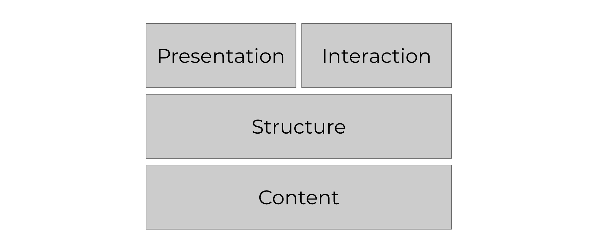
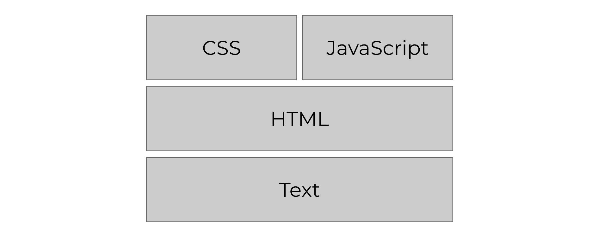
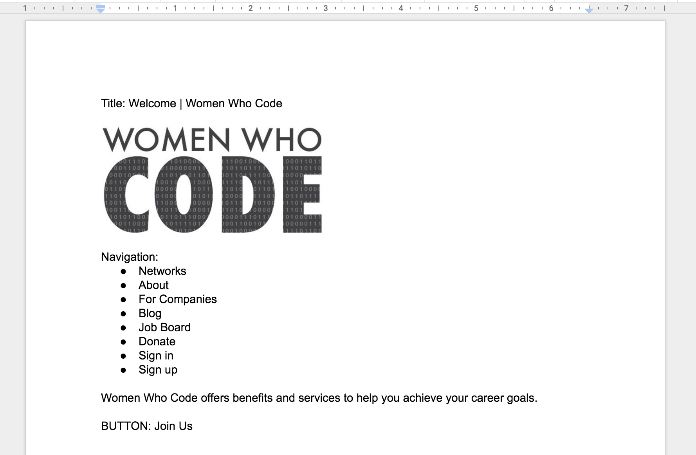
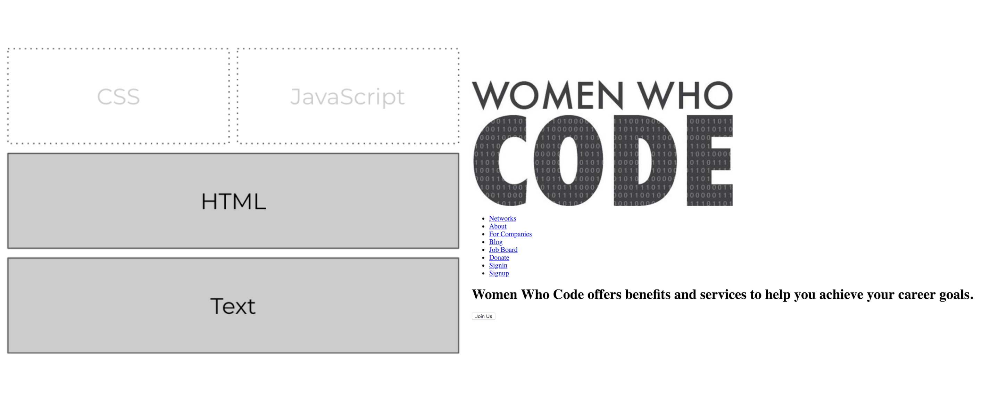
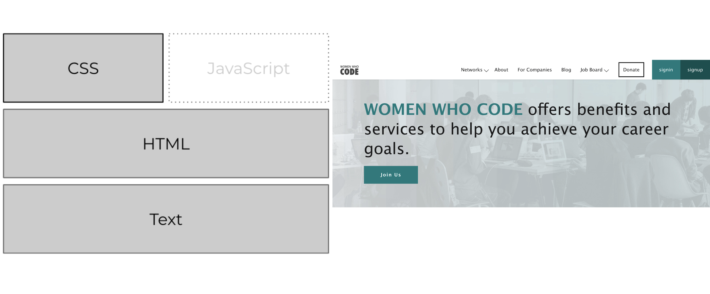

## Overview

HTML, CSS, and JavaScript work hand in hand to create the web pages that we access and use almost daily. But how do these three separate technologies work together to do so?

Below is a basic structure of a web page. They can be thought of as building blocks.

And to build each block, the following are the technologies used:

We'll discuss in detail what each building block is for along with their corresponding technologies.

## Content

**Content** is the main foundation of every web page. Without any **text, images, videos, audio, or basic content**, your website would not be conveying anything to the user visiting it. The very basic purpose of your website is to *provide information*. Your purpose could be to sell a product, to serve as your portfolio, to promote your business, to serve as a place where other people can interact with one another, to let curious people search for something they don't know. Whatever reason it may be that you want to create a website, content is definitely an important thing to think about before starting.

Below is sample content for the Women Who Code website made just in a normal document. This is simply a compilation of ideas which includes the words to use, the logo to be used, the navigation pages, and the call to action (text used for the button).

## HTML - Structure

After deciding on the content, you have to set up your website. You have to know how to organize it well, where each link goes, how each web page connects to the other parts of your site. You also have to decide on the **hierarchy of information**. Which are headings? Which are paragraphs? Which are links? Which are images? This is where **structure** comes in. With this **semantics** is very important. Structure can be achieved using **HTML (HyperText Markup Language)**. The image shown below shows the website built using only HTML with the content mentioned earlier.

## CSS - Presentation

The **presentation** and **interaction** block (CSS and JavaScript) both sit on top of the structure for our building blocks. This means that one or the other is *optional*. You can choose to have interaction without presentation (meaning you only use JavaScript). You can also choose to have presentation without interaction (only CSS). You can also have them both on your website (most websites usually have both).

Once the structure of your web page is finished, **presentation** will let you include styles on your site. This is where you can bring out the designer within you to define what font to use, what font size corresponds to each heading and paragraph, what the background color or background image of the site will be, how large or how small the images are, how big the space is between elements, how the paragraphs will be aligned (justified, centered, left-aligned, or right-aligned)—any possible design you can think of can be done with the help of **CSS (Cascading Style Sheets)**. The finished Women Who Code website with added styling using CSS is shown in the picture below.

## JavaScript - Interaction

Meanwhile, **interaction** can give life to your website and change your visitors' overall experience. With interaction, you can make a static website behave more dynamically. This is achieved using JavaScript.

How does JavaScript make more web pages more interactive? It does this by reacting to events that the user does. Every JavaScript function ever involves an **event** to trigger it to perform an **action**.

The **event or trigger** can be clicking a button, scrolling to a certain section of the site, typing a specific character, or just waiting for 30 seconds after the page loads, to name a few. After the event happens, JavaScript **accesses elements of the page**. For example, it can select all elements with the class 'container', all the images within the first container, the button with an id of 'sign-up-button', or the text that a user typed in an input field with the id 'username'. Finally, after the event and accessing elements of the page, an **action** is performed on the selected elements.

To be more specific, here are just some of the things you can do using JavaScript to introduce interaction in your site:
* as visitors type in the search bar, you can give suggestions to complete the search (like what Google does!)
* 30 seconds after the page loads, you can show a popup containing a form where visitors can subscribe to a newsletter
* on click of an image, you can change the current image into a different image
* on submission of a form, you can validate the user's input
* on click of a button, you can change the color of all paragraph texts from black to gray
* on typing in a text field and clicking a button, you can create a new paragraph tag containing the text you typed

The possibilities are endless!
